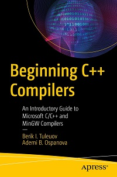

# Apress Source Code

This repository accompanies [*Beginning C++ Compilers: An Introductory Guide to Microsoft C/C++ and MinGW Compilers*](https://www.link.springer.com/book/10.1007/9781484295625) by Berik I. Tuleuov and Ademi B. Ospanova(Apress, 2024).

[comment]: #cover

Download the files as a zip using the green button, or clone the repository to your machine using Git.

## Releases

Release v1.0 corresponds to the code in the published book, without corrections or updates.

## Contributions

See the file Contributing.md for more information on how you can contribute to this repository.